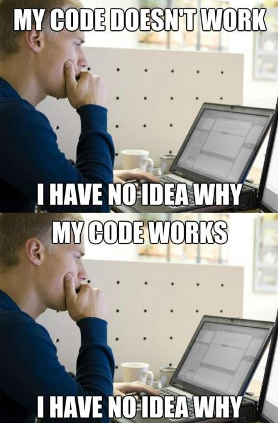

# **스타트업을 위한 코딩입문**

2023년 1학기

---

# 이번 강의에 대한 간략한 소개

스타트업을 창업하는데 필요한 코딩과 **문제해결 스킬**을 배웁니다.
기술발전이 무척 빠르기 때문에 오늘 배운게 6개월 후에는 쓸모 없어 질지도 모릅니다.
그래서 이 수업에서는 **무엇이든 빠르게 배울 수 있는 방법**에 집중합니다. 그리고 세상이 바뀌어도 **변하지 않을 것(역사, 진리 등)들**을 탐구합니다.

How to start a startup.

Learning how to learn.

---

# 스타트업이란?

> 스타트업은 새로운 비즈니스 모델, 제품, 서비스, 기술 등을 창출하며, 이를 기반으로 창업한 미래성장성을 갖춘 벤처기업을 의미합니다. 기존의 산업 구조를 뒤엎을 만한 혁신적인 아이디어와 전략적인 비전을 가져야 합니다. 이를 위해 창업자는 자신의 아이디어를 시장에서 검증하고 개선하기 위한 끊임없는 노력과 도전을 해야 합니다.
>
>
> 스타트업은 새로운 비즈니스 모델과 기술을 통해 새로운 시장을 개척하거나 기존 시장에서 혁신을 가져와 경쟁우위를 확보합니다. 이를 위해 빠른 시장 진입과 빠른 성장을 목표로 합니다. 그러나 초기의 경쟁력 확보와 함께 수익 창출이 이루어지지 않을 경우 경영 난제를 마주하게 되므로, 경영 전략과 수익 창출 방법에 대한 철저한 계획이 필요합니다.
>
> 최근 들어 스타트업은 경제성장과 취업창출에 대한 중요성이 부각되면서, 다양한 기술과 비즈니스 아이디어를 가진 창업자들이 쏟아져 나오고 있습니다. 이에 따라 정부와 기업들은 스타트업을 지원하는 프로그램 및 시설을 마련하고 있으며, 스타트업 에코시스템이 형성되어 가고 있습니다. by ChatGPT

---

# 중소기업 vs 스타트업

> Small and medium-sized businesses (SMBs)는 소규모 기업으로서, 소규모의 규모와 수익성을 중심으로 운영됩니다. 일반적으로 성숙한 비즈니스 모델을 가지고 있으며, 제한된 자원을 가지고 있는 경우가 많습니다. 대부분의 SMBs는 기존 시장에서 경쟁하며, 수익 창출에 초점을 맞추고 있습니다.
>
> 스타트업은 기술 혁신과 창조적인 비즈니스 모델을 통해, 새로운 시장을 개척하거나 기존 시장에서의 경쟁 우위를 확보하고 성장하는 벤처 기업입니다. 초기 단계에서는 많은 리소스와 도전적인 경영 전략이 필요하지만, 큰 스케일의 성장과 글로벌 시장에 대한 진출을 목표로 합니다. 스타트업은 일반적으로 경쟁력을 확보하고 수익을 창출하는 데에 시간이 더 걸릴 수 있으며, 높은 수익률과 기업 가치를 추구합니다. by ChatGPT

⇒ 당신이 꿈꾸는 **사업/일**은 어떤건가요?

---

# 강사 소개

- 최용철 기업가센터 겸임교수, cyc@snu.ac.kr, 010-9327-8733
- 2020, “엔트로피패러독스” 소프트웨어 개발스튜디오 창업
- 2013, 멋쟁이사자처럼 창립
- 2010, 서울대 학생벤처네트워크 활동
- 서울대 컴퓨터공학부 학사
- 연세대 금융공학 석사과정
- 한양대 데이터사이언스학부 IAB 자문교수

---

# 조교 소개

- 최자연

---

# 강의 일정

1주차 - 오리엔테이션

2주차 - 아이디어 스케치하기 (아이디어 불패의 법칙)

3주차 - 피그마 특강

4주차 - [bubble.io](http://bubble.io) 사용하기 1

5주차 - [bubble.io](http://bubble.io) 사용하기 2

6주차 - 엑셀 기초 익히기

7주차 - 파이썬을 이용한 프로그래밍 기초 1

8주차 - 파이썬을 이용한 프로그래밍 기초 2

---

# 강의 일정

9주차 - 컴퓨터과학 소개

10주차 - (어린이날, 동영상강의 대체) 스타트업 인간관계론

11주차 - 웹 개발 입문 1

12주차 - 웹 개발 입문 2

13주차 - 스타트업 제품 개발 방법론

14주차 - 퍼포먼스 마케팅의 이해

15주차 - 한 학기 동안 배운 내용 정리 및 소감 발표

특별 코스: ChatGPT를 활용한 챗봇만들기

---

# 강의 시간 구성

- 특정 주제로 50분 강의
- 체험 또는 실습하며 노트 정리 50분
- (수업 종료 후) 나머지 공부 시간

---

# 학습 방법

- ChatGPT를 적극 활용할 예정입니다.
- 최대한 인터넷에 공유된 자료를 활용합니다.
  - (ChatGPT) > 공식문서 >> 스택오버플로우 > 블로그에 정리된 내용
- 나만의 레시피 노트를 정리합니다.
  - 갑자기 문제가 터지는 건 당연합니다. (문제가 안생기면 개발자들은 어리둥절합니다)
  - 문제해결 노하우를 다른 사람 또는 미래의 나에게 공유합니다.

---

# 수업 준비물

- 노트북 필수 준비
- 설치해야 할 것들
  - VS code 설치 ([https://code.visualstudio.com](https://code.visualstudio.com/))
  - Github Desktop 설치 ([https://desktop.github.com](https://desktop.github.com/))
  - Anaconda 설치 ([https://www.anaconda.com](https://www.anaconda.com/))
- 가입해야 할 것들
  - Gmail 가입 (소문자/점/숫자 ⇒ 자신의 이름/영어이름 등으로 조합)
  - Figma 가입 (gmail로 가입 및 로그인)
  - Github 가입 (소문자로만 ⇒ 온라인용 닉네임 짓기)
  - Notion 가입 (ewhain.net 사용하여 학생 혜택 받기)
  - [chat.openai.com](http://chat.openai.com) 가입 (gmail로 가입 및 로그인)

---

# 성적 평가

1. 과제 제출 10회 ⇒ 수업 노트 정리
    1. 함께 공부할 수 있는 좋은 자료가 됩니다.
2. 기말 발표 (지난 수업: [https://www.youtube.com/watch?v=RlxzMeL7hAU](https://www.youtube.com/watch?v=RlxzMeL7hAU))
    1. 수강생이 많은 관계로 마지막 세 주(13/14/15주차)로 나누어서 진행
    2. 한 학기 동안 배운 내용을 정리&제출 5분 발표 (13/14주차)
    3. 개발 프로젝트를 진행한 학생들은 마지막인 15주차에 발표

---

# 성적 기준

- A+: 성실하게 수업을 따라왔으며, 최종결과물의 성과가 우수하다.
- A: 성실하게 수업을 따라왔으며, 최종결과물의 성과가 괜찮다.
- A-: 성실하게 수업을 따라왔으며, 최종결과물의 발전 여지가 크다.
- B+: 수업을 적당히 따라 왔으며, 최종결과물의 성과가 우수하다.
- B: 수업을 적당히 따라 왔으며, 최종결과물의 성과가 괜찮다.
- B-: 수업을 적당히 따라 왔으며, 최종결과물의 발전 여지가 크다.
- C이하: 부족한 부분에 대한 학습이 필요하다.

---

# 추천 도서

- 마인드셋, 캐럴 드웩
- 아이디어 불패의 법칙, 알베르토 사보이아
- 인스파이어드, 마티 케이건
- 사업의 철학, 마이클 거버

결석으로 인해, 수업노트 제출이 힘들 경우 위 추천 도서 또는 자신이 읽고 싶은 책에 대한 요약문으로 대체할 수 있습니다.

---

# 코딩 수업 준비 운동

영어 타자연습 - WPM 50이상 목표로, 평소 꾸준히 연습하기

참고: [https://www.speedcoder.net/lessons/js/1/](https://www.typingtom.com/programming/typing-test/1m)

---

# Q&A

---

# 수업 참여자 소개

1. 자기소개 입력 링크: [https://abit.ly/pmxzih](https://abit.ly/pmxzih)
2. 5분간 빠르게 자기소개를 제출하고, 결과지를 전체 공유할 예정입니다.
3. 서로 모르는 사람을 찾으세요.
4. 옆 사람과 2명씩 짝지어 통성명 후 상대의 결과지를 읽어보고 5분간 서로 인사합니다.
5. 다시 한번 짝을 바꿔 서로 5분간 인사합니다.

---

# EOD
